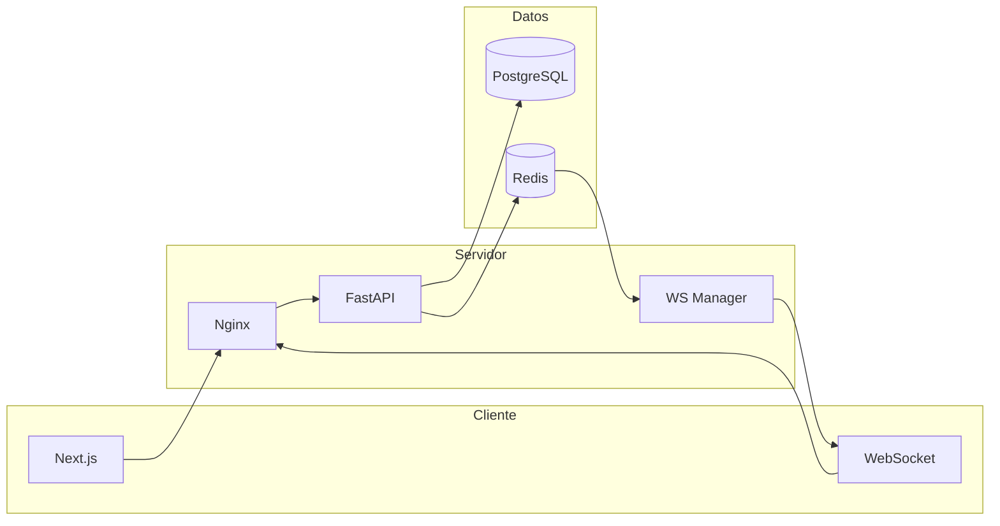

# Polla Deportiva 2026

Plataforma fullstack para **pollas de pronósticos deportivos**: los participantes predicen marcadores, compiten en rankings y gestionan apuestas con montos, premios y flujos de aprobación administrativa. Pensada para grupos reales (oficina, amigos, ligas internas) con panel de administración, perfiles públicos y notificaciones en tiempo real.

**Repositorio:** [github.com/yoredstorm/polla2026-miatech](https://github.com/yoredstorm/polla2026-miatech)

---

## Características principales

### Para jugadores

| Funcionalidad | Descripción |
|---------------|-------------|
| **Pronósticos por partido** | Marcador local/visitante; una predicción gratuita por partido y apuestas extra opcionales según la polla activa. |
| **Bloqueo automático** | Los partidos se bloquean ~1 hora antes del inicio; el admin puede abrir/cerrar apuestas manualmente. |
| **Puntuación automática** | Al finalizar un partido, el sistema calcula puntos y actualiza rankings. |
| **Mis apuestas** | Historial, estado de solicitudes de cambio y acciones sobre apuestas propias. |
| **Solicitudes de cambio** | Pedir modificar o eliminar una apuesta; el admin aprueba o rechaza (con motivo). |
| **Perfil público** (`/u/{username}`) | Ver apuestas de otros usuarios según privacidad (público o solo con código de invitación). |
| **Copiar apuestas** | Copia masiva desde un perfil público o copia individual del mismo partido con marcador editable. |
| **Ranking global y semanal** | Clasificación por puntos, precisión o cantidad de apuestas; filtros configurables. |
| **Dashboard** | Resumen de polla activa, partidos próximos y estado de la cuenta. |

### Para administradores

| Funcionalidad | Descripción |
|---------------|-------------|
| **Gestión de pollas** | Crear polla activa, cuota de entrada, moneda, modo de monto (`single_entry` / `per_bet`) y monto fijo por apuesta. |
| **Miembros** | Confirmar entrada, listar pendientes, agregar o quitar participantes. |
| **Partidos** | Cargar calendario desde `worldcup.json`, editar equipos/fecha/estadio, resultados y estado. |
| **Apuestas extra** | Confirmar pagos pendientes antes de sumar al pozo de premios. |
| **Solicitudes** | Bandeja central de cambios de apuesta (aprobar / rechazar con notas). |
| **Auditoría** | Registro de acciones (`bulk_copy`, cambios, altas, etc.) con filtros en panel de actividad. |
| **Usuarios** | Listado, activar/desactivar cuentas y rol administrador. |

### Notificaciones en tiempo real

- **WebSocket** autenticado por cookie (`/api/v1/ws/notifications`).
- **Redis pub/sub** para entregar eventos entre procesos.
- **Campana en la barra** con badge de no leídas, historial paginado y toasts.
- **Admins:** alertas de solicitudes de cambio, apuestas extra pendientes y entradas por confirmar; acciones inline (aprobar, rechazar, confirmar pago, confirmar entrada).
- **Usuarios:** aviso cuando se resuelve una solicitud (aprobada/rechazada, con motivo si aplica).
- **Respaldo:** polling del contador cada 30 s si el WebSocket no está conectado.

### Seguridad y UX

- JWT en **cookies httpOnly** (access + refresh), rotación y logout con invalidación.
- **bcrypt** para contraseñas, rate limiting en login y API, bloqueo tras intentos fallidos.
- CORS restringido, headers de seguridad, validación **Pydantic**, solo ORM (sin SQL crudo).
- Cierre de sesión por **inactividad** configurable en el cliente.
- UI moderna: **Next.js 14**, Tailwind, animaciones, sistema de **toasts** (Zustand).

---

## Sistema de puntuación

| Resultado | Puntos |
|-----------|--------|
| Marcador exacto | **2** |
| Ganador correcto (local / visitante / empate) | **1** |
| Incorrecto | **0** |

Los puntos se asignan automáticamente al marcar un partido como finalizado con resultado cargado.

---

## Distribución de premios (polla)

Configuración típica del pozo acumulado:

| Puesto | Porcentaje del prize pool |
|--------|---------------------------|
| 1.º | 60 % |
| 2.º | 30 % |
| 3.º | 10 % |

---

## Stack tecnológico

| Capa | Tecnología |
|------|------------|
| Backend | Python 3.12, **FastAPI**, SQLAlchemy 2 (async), Alembic |
| Frontend | **Next.js 14** (App Router), TypeScript, TanStack Query, Zustand |
| Base de datos | **PostgreSQL 16** |
| Caché / pub-sub | **Redis 7** |
| Proxy | **Nginx** (API + frontend + WebSocket upgrade) |
| Datos deportivos | **`worldcup.json`** (seed local) + edición admin |
| Contenedores | **Docker Compose** |

---

## Arquitectura (resumen)



---

## Requisitos previos

- [Docker](https://www.docker.com/) y Docker Compose v2
- (Opcional) Node.js 20+ y Python 3.12+ para desarrollo local sin Docker

---

## Instalación rápida (Docker)

### 1. Clonar el repositorio

```bash
git clone https://github.com/yoredstorm/polla2026-miatech.git
cd polla2026-miatech
```

### 2. Variables de entorno

```bash
cp .env.example .env
cp backend/.env.example backend/.env
cp frontend/.env.example frontend/.env
```

Editar al menos:

| Archivo | Variables clave |
|---------|-----------------|
| `.env` (raíz) | `POSTGRES_PASSWORD`, `REDIS_PASSWORD` — **fuente única** para Docker |
| `backend/.env` | `JWT_SECRET_KEY`, `JWT_REFRESH_SECRET`, etc. |
| `frontend/.env` | Opcional: `NEXT_PUBLIC_API_URL` (si no usas el puerto 8000 del host) |

Con Docker, `docker-compose.yml` inyecta `DATABASE_URL` y `REDIS_URL` en el backend usando las contraseñas del `.env` raíz; no hace falta duplicarlas en `backend/.env` (si las pones ahí, deben coincidir).

Genera secretos JWT con `python backend/scripts/generate_secrets.py` (mínimo 32 caracteres en producción).

**Error `password authentication failed for user polla_user`:** suele ser contraseña distinta entre `.env` raíz y la que quedó guardada en el volumen de Postgres la primera vez que levantaste Docker. Opciones:

1. Alinear `.env` raíz con la contraseña original del volumen, o  
2. Recrear la base (borra datos): `docker compose down -v` y luego `docker compose up -d --build` y `alembic upgrade head`.

### 3. Levantar servicios

```bash
docker compose up -d --build
```

### 4. Migraciones

```bash
docker compose exec backend alembic upgrade head
```

### 5. Acceder

| Servicio | URL |
|----------|-----|
| Frontend (directo) | http://localhost:3000 |
| API | http://localhost:8000 |
| Entrada unificada (Nginx) | http://localhost |
| Swagger | http://localhost:8000/docs |
| ReDoc | http://localhost:8000/redoc |

> **Windows:** si `localhost` no responde, prueba `http://127.0.0.1:3000` o `:8000` (resolución IPv6).

> **Cookies y WebSocket:** usa el **mismo host** en navegador y API (todo `localhost` o todo `127.0.0.1`). Mezclar hosts rompe la sesión y el WS de notificaciones.

---

## Desarrollo local (sin Docker)

### Backend

```bash
cd backend
python -m venv venv
# Windows: venv\Scripts\activate
# Linux/macOS: source venv/bin/activate
pip install -r requirements.txt
cp .env.example .env
alembic upgrade head
uvicorn app.main:app --reload --host 0.0.0.0 --port 8000
```

### Frontend

```bash
cd frontend
npm install
cp .env.example .env.local
npm run dev
```

### Tests

```bash
cd backend
pip install aiosqlite
pytest --cov=app --cov-report=term-missing
```

---

## Calendario de partidos

Los fixtures del Mundial 2026 se cargan desde `backend/asset/worldcup.json` al iniciar (si la tabla está vacía) o con **Admin → Partidos → Re-seed**. El admin puede editar equipos, fechas, resultados y estado manualmente.

En producción con varios workers de Uvicorn, use **1 worker** o **sticky sessions** en Nginx para `/api/v1/ws/notifications` (WebSocket).

---

## Estructura del proyecto

```
polla2026-miatech/
├── backend/
│   ├── app/
│   │   ├── api/v1/          # auth, fixtures, bets, groups, users, leaderboard, admin, notifications, ws
│   │   ├── core/            # config, security, rate limiting, middlewares
│   │   ├── db/migrations/   # Alembic (0012+ notifications, change requests, audit…)
│   │   ├── models/
│   │   ├── schemas/
│   │   └── services/        # bets, groups, notifications, ws_manager…
│   └── tests/
├── frontend/
│   ├── app/                 # App Router (dashboard, admin, perfiles públicos…)
│   ├── components/
│   ├── hooks/
│   └── lib/
├── docker-compose.yml
├── nginx.conf
└── README.md
```

---

## API relevante (referencia)

| Área | Endpoints (prefijo `/api/v1`) |
|------|-------------------------------|
| Auth | `POST /auth/register`, `/auth/login`, `/auth/refresh`, `/auth/logout` |
| Partidos | `GET /fixtures`, `GET /fixtures/live`, `GET /fixtures/{id}` |
| Apuestas | `POST /bets`, `GET /bets/my`, `POST /bets/bulk-copy`, `POST /bets/{id}/change-request` |
| Polla | `GET /groups/active-polla`, miembros, leaderboard de grupo |
| Ranking | `GET /leaderboard`, `GET /leaderboard/weekly` |
| Notificaciones | `GET /notifications`, `PATCH /notifications/{id}/read`, WebSocket `/ws/notifications` |
| Admin | fixtures, usuarios, grupos, extras, solicitudes, auditoría |

Documentación interactiva en `/docs` con la API en ejecución (deshabilitada cuando `APP_ENV=production`).

---

## Seguridad (OWASP Top 10 — resumen)

| Riesgo | Medida implementada |
|--------|---------------------|
| Control de acceso | JWT en cookies httpOnly; rol `is_admin` solo en BD (no en el JWT); `CurrentAdmin` en todos los endpoints `/admin` |
| Criptografía | bcrypt; JWT HS256 con `kid` y rotación semanal en producción; refresh hasheado (SHA-256) en BD |
| Inyección | ORM + validación Pydantic |
| Diseño inseguro | Rate limits (login, refresh, change-password) con SlowAPI + Redis |
| Configuración | CORS whitelist, CSP/HSTS en producción, OpenAPI off en producción |
| Autenticación | Access 15 min; refresh rotado en cada `/auth/refresh`; detección de reutilización; una sesión activa por login |
| Secretos | `python backend/scripts/generate_secrets.py` — nunca commitear `.env` |
| Registro | structlog sin cookies; Sentry con scrub de tokens/cookies |
| SSRF | Sin llamadas HTTP salientes a APIs deportivas externas |

### Generar llaves (obligatorio en producción)

```bash
cd backend
python scripts/generate_secrets.py
```

Copia la salida a `backend/.env` en el servidor. En producción `JWT_SECRET_KEY` y `JWT_REFRESH_SECRET` deben estar definidos en el entorno (mín. ~43 caracteres).

### Checklist manual post-despliegue

- [ ] Login: JSON sin `access_token` / `refresh_token`; cookies `HttpOnly` + `Secure` (HTTPS).
- [ ] Usuario no admin: `GET /api/v1/admin/stats` → **403**.
- [ ] `APP_ENV=production`: `/docs` no disponible; HSTS presente.
- [ ] Tras `/auth/refresh`, la cookie `refresh_token` cambia; la anterior no sirve.

---

## Roadmap / mejoras posibles

- Página dedicada `/notifications` con historial completo
- Soporte multi-worker con balanceo y sticky sessions para WebSocket
- Notificaciones por correo o push móvil
- Más ligas y deportes

---

## Licencia

Proyecto privado — **Miatech / Pablo Pimentel**. Consultar al propietario del repositorio antes de redistribuir o usar en producción sin autorización.

---

## Créditos

Desarrollado como **Polla Deportiva 2026** — pronósticos, competencia y gestión de grupo en una sola plataforma.
